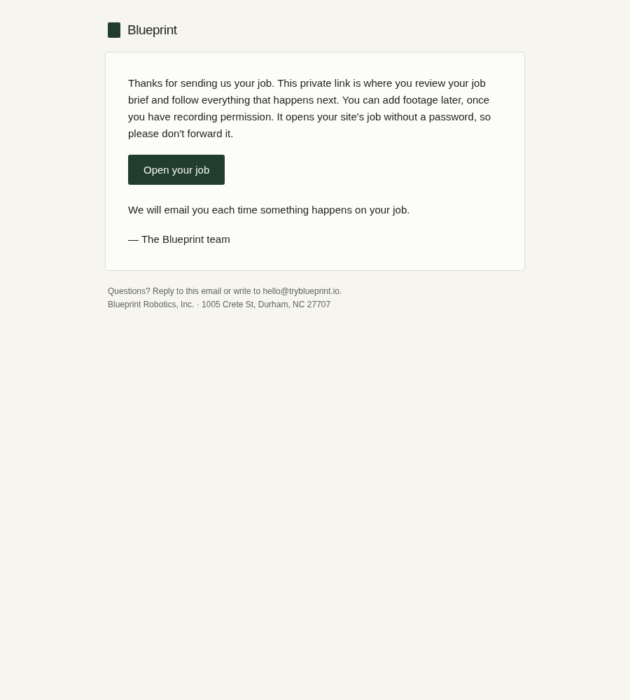
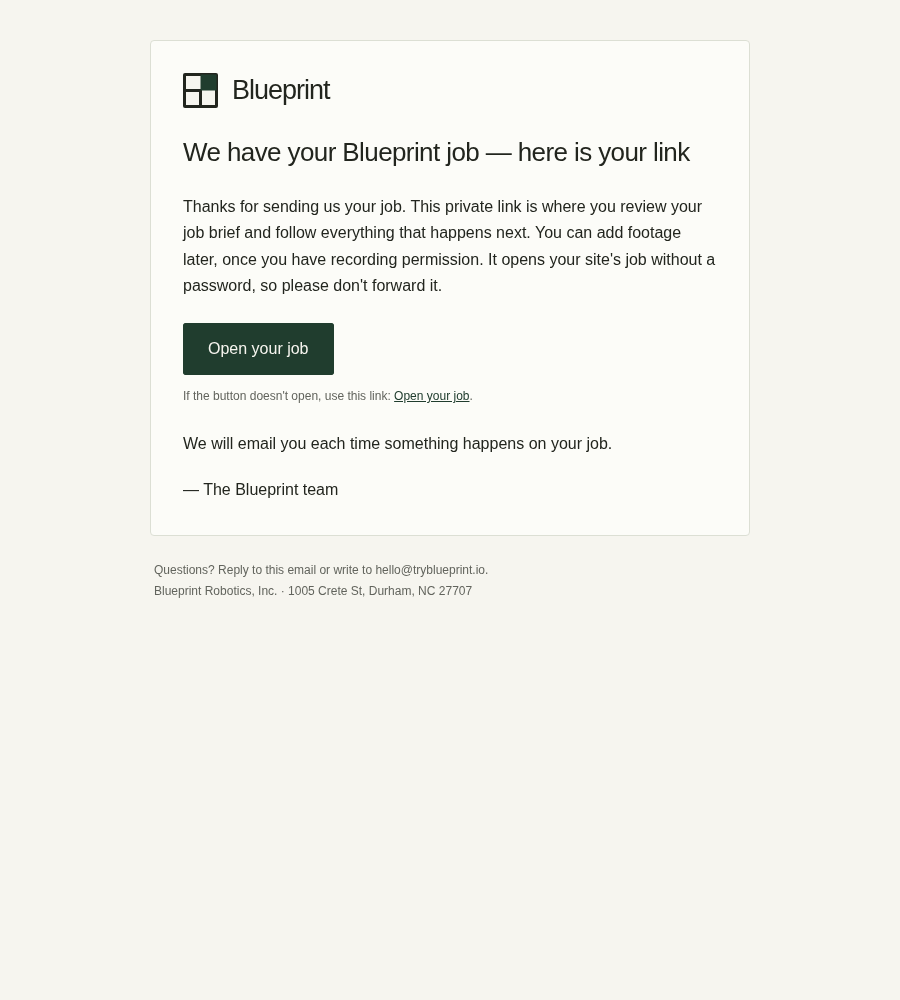
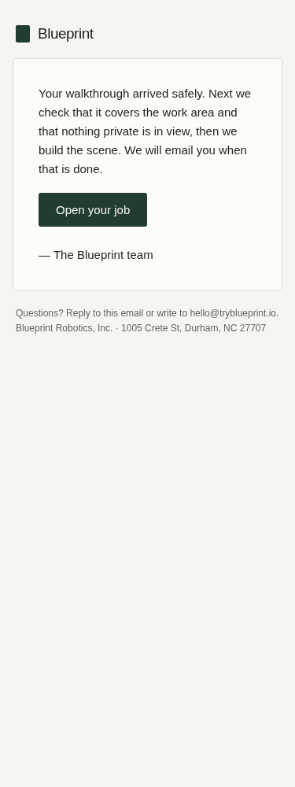
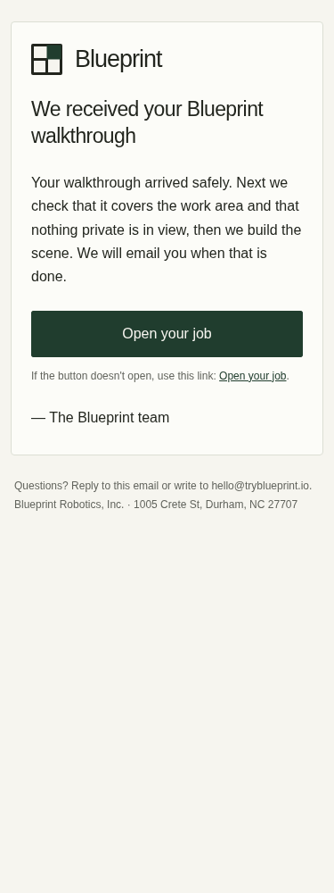

# Transactional email branding candidate

Application confirmations and queued job notices now use Blueprint's existing
site mark, a live-text wordmark, a visible message heading, 16px body text, and
a 52px CTA. Mobile padding gives the message more space; supported dark-mode
clients receive a matching dark palette. A secondary text link preserves the
button's exact destination without displaying a long signed token. The complete
original template and URL remain in the plain-text part.

## Source and scope

- Base: `a99f86eb9977ce9822397bf7a6108a751508a22f` in `ognjhunt/Blueprint-WebApp`.
- Provider: `server/utils/email.ts` uses `Resend` and `resend.emails.send`.
  `docs/runbooks/resend-email.md` records `Blueprint <noreply@tryblueprint.io>`
  as the default application sender. No provider configuration was changed.
- The supplied subjects map to `task_received` and `video_received` in
  `server/utils/taskLifecycleNotifications.ts`. Delivery follows
  `captureOutbox.ts` → `brandedEmail()` → `sendEmail()` → Resend.
- The shared layout also serves inbound-request and contact confirmations.
  Personal Gmail communications drafts do not use this layout.
- Visual source: `client/public/brand/mark.svg` and the public site's
  `minimal-site.css`. `email-mark.png` exports the unchanged official SVG at
  140×140 for 35px display, using a paper background and local Chromium.
- Recipients, sender/reply routing, subjects, original body copy, authorization,
  token URLs, legal address, consent, pricing, and unsubscribe behavior are
  preserved. The heading repeats the existing subject. No external email,
  provider-account, DNS, credential, security-setting, or spending action ran.
- This change affects the logo inside the message. It does not configure the
  separate sender avatar displayed by an inbox.

## Actual local renders

These are Chromium pixels from the source templates with a synthetic token,
not screenshots of delivered mail. Every external request was intercepted;
only the checked-in PNG was supplied locally.

| Receipt | Before | After |
| --- | --- | --- |
| Job link, desktop |  |  |
| Walkthrough, mobile |  |  |

[Dark-mode render](walkthrough-after-dark.png) ·
[Images-blocked render](walkthrough-after-images-blocked.png) ·
[Measured browser checks](browser-proof.json) · [Synthetic fixtures](fixtures.json)

The supplied mailbox screenshots could not be inspected in this executor:
both required Library transfer-helper downloads returned
`library file transfer failed: download failed with HTTP status 403`.
Library descriptions are not pixel evidence. Parent-session materialization
and inspection of both originals remain required before release.

## Validation and reproduction

- `npm run check`: passed.
- Focused Vitest: six files, 28 tests passed (`email-layout`, `email`,
  `email-provider-receipt`, `site-task-received-email`,
  `task-lifecycle-notifications`, `capture-outbox`). All delivery calls in
  these tests are mocked; none sends mail.
- `npm run audit:assets`: passed.
- `BLUEPRINT_ALLOW_UNCONFIGURED_CLIENT_BUILD=1 npm run build`: passed as the
  documented compile-only build. This executor has no Firebase client build
  variables; the artifact is not a deployable sign-in proof. The built public
  PNG matches the source PNG byte for byte.
- Required `bash scripts/graphify/run-webapp-architecture-pilot.sh --no-viz`:
  passed. This is local AST extraction, not a provider call.
- Twelve browser scenarios passed: both receipt templates at 900px desktop,
  375px mobile/dark/images-blocked, and 320px with the stylesheet removed or
  a long signed-token URL. No horizontal overflow; 52px primary targets;
  primary and fallback destinations equal. Live text remains readable with
  the image blocked. This does not establish Gmail or Outlook inbox rendering.
- Independent read-only review found no blocking implementation defects.
  The reviewer independently passed seven focused layout tests and all twelve
  browser modes, checked escaping and preserved transactional controls, and
  identified one QA weakness: normal modes must also assert logo loading.
  That assertion is now included; the renderer was rerun after the fix.

Recover the code, fixtures, PNGs and this report from this repository/PR;
Library and session storage are not production dependencies. With existing
dependencies and Playwright Chromium installed, regenerate local proof with:

```bash
npx tsx scripts/qa/render-email-branding.ts
```

For an existing system Chromium, use
`EMAIL_QA_CHROMIUM=/usr/bin/chromium`. Results are written under
`output/qa/email-branding/latest/` as HTML, plain text, PNG and JSON. No
credentials or external sends are needed. The before pixels correspond to
the base commit above; the fixture text was extracted from that commit's
two pure lifecycle template bodies without importing delivery or storage.

Asset provenance (SHA-256):

```text
brand/mark.svg: 5b5f794315a196de0fcb98f5a747fef513d7d3a660005a0085ae4be2bfb29107
brand/email-mark.png: b2fbf6c2e313ea1de50c31a0470417ed04f3388d4f0f4d4d1c08b3f58874dfe7
```

## Release handoff

The candidate must remain a draft until the parent verifies the original
screenshots, independent review is resolved, and exact-head PR CI is green.
The parent must coordinate release owner
`01a1119c-3d06-7099-9fde-19dac4ac90ef` before normal merge or deployment because
communications recovery and the site upload test share the web/worker release.
No lane-local Render trigger or provider/environment change is needed.

After coordination, use the normal PR merge. The existing CI-gated deploy
workflow must bring both web and worker live at the green merged SHA. Verify
`/version.json`, `/health`, `/health/ready`, and the new public PNG (HTTP 200,
`image/png`, expected SHA-256). Do not invoke a notification retry, outbox
delivery, or new test send as a read-only release probe.

Source thread: `01a0fe81-486b-7714-9e81-983a66bd80c4`.
ADP backlog/day gate and task budget were not supplied; this is the owner's
explicit branding request for the existing partner/job intake receipts.
Remaining gates are screenshot pixels and coordinated release, not new
user approval for the already-authorized implementation.
